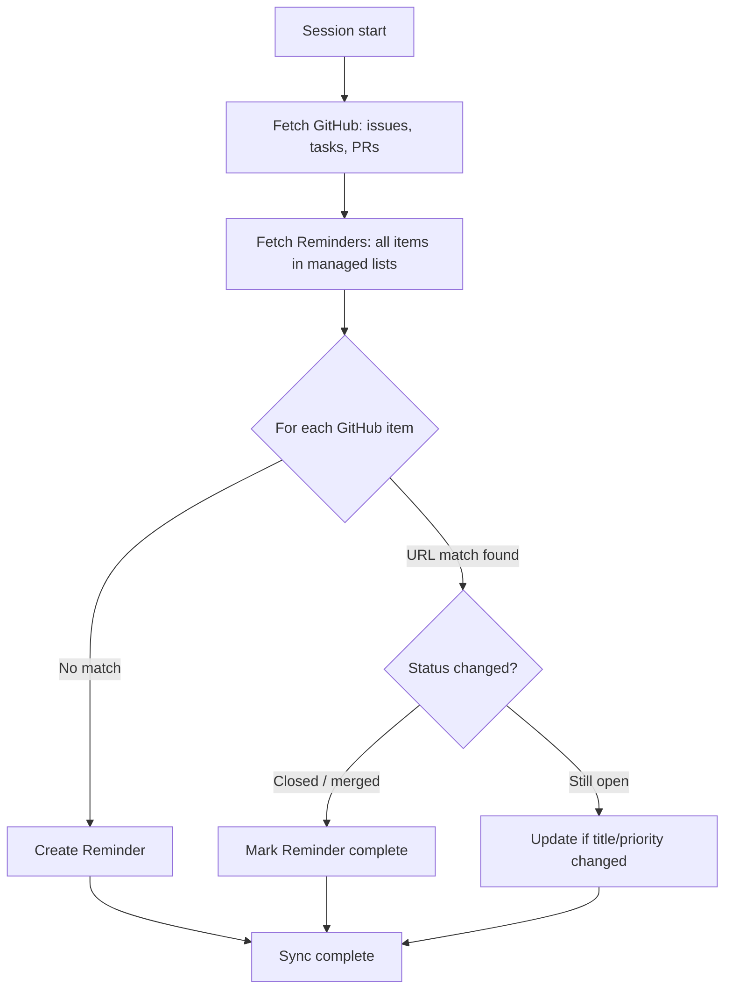

# F-2: Daily Standup Summariser — Design Document

_Author: Michelangelo Setaro & Patchani_

_Created: 2026-07-10_

---

## 1. Introduction

### Problem Statement

Context on open work — assigned issues, in-progress tasks, open PRs — is scattered across GitHub and lost between sessions. There is no shared, persistent view of what is on the plate that both the user and Patchani can read and update.

### Goals

- Sync GitHub activity into Apple Reminders at session start, automatically
- Provide a structured, persistent task list shared between user and Patchani
- Lifecycle follows GitHub: item closed or merged → Reminder marked complete
- Patchani can write cross-session continuity notes into the shared list

---

## 2. Background

Apple Reminders is the persistence layer — visible on Mac, iPhone, and widget without opening Claude. GitHub is the only source of truth for work items. The MCP bridge between the two is `mcp-server-apple-events` (`FradSer/mcp-server-apple-events`) — full CRUD on Reminders lists and items, priority support, URL field in body, pre-built binary via npx.

The GitHub MCP provides assigned issues, Projects items, and PR state.

---

## 3. Use Cases

### UC-1: Session Start Sync

**Stakeholders:** User, Patchani

**What:** On session start, Patchani pulls assigned issues, Projects tasks, and open PRs from GitHub and syncs them into the corresponding Reminders lists.

**Success criteria:**
- All open assigned issues appear in the Issues list with a link and one-line summary
- Items closed or merged on GitHub since last sync are marked complete in Reminders
- No duplicate items created for items already present; GitHub URL is the canonical ID

### UC-2: Cross-session Continuity

**Stakeholders:** User, Patchani

**What:** At session end, Patchani writes any in-progress work or next steps into the Patchani ToDo list. On the next session start, Patchani reads this list to resume context.

**Success criteria:**
- WIP items created by Patchani are visible in Reminders before the next session
- User can add items to Patchani ToDo manually; Patchani reads them on next start
- User can trigger this write on-demand during a session, not only at session end

---

## 4. System Design

### Reminder Lists

| List | Written by | Source |
|---|---|---|
| **Issues** | Patchani | GitHub assigned issues |
| **Tasks** | Patchani | GitHub Projects items assigned to user |
| **PRs** | Patchani | Open PRs authored by user |
| **Patchani ToDo** | Patchani + user | Session notes, WIP, next steps |

### Sync Logic



**Deduplication:** GitHub URL embedded in Reminder body is the canonical ID. On each sync, Patchani reads existing items in each list and matches by URL before creating.

**Priority mapping:**

| GitHub signal | Reminder priority |
|---|---|
| Label: `P0`, `critical`, `urgent` | High |
| Label: `P1`, `priority:high` | High |
| Label: `P2`, `priority:medium` | Medium |
| Label: `P3`, `priority:low`, or none | Low |
| No labels → body analysis | Patchani infers from content |

**Reminder body format:**
```
<one-line summary distilled from issue/PR body>
→ <GitHub URL>
```

### Open Points

| # | Open Point | Impact | Resolution path |
|---|---|---|---|
| OP-1 | **First-run list initialisation** — the four Reminders lists may not exist on a fresh install. | Sync fails silently if target lists are missing. | Resolved: on first run, Patchani checks for each list and creates any that are absent before sync begins. |
| OP-2 | **GitHub Projects v2 coverage** — the GitHub MCP may not expose Projects v2 items via the same endpoint as issues. | Tasks list scope limited to issues only in v1. | Resolved: the official GitHub MCP server (`github/github-mcp-server`) exposes a native `projects` toolset with `projects_list` and `projects_get`. Requires `read:project` PAT scope. Included in v1. |

---

## 5. Verification Criteria

- **Sync correctness:** after a sync, every open assigned GitHub issue has a matching Reminder in the Issues list; no duplicates exist
- **Lifecycle:** closing an issue on GitHub and re-running sync results in the corresponding Reminder being marked complete — not deleted
- **Deduplication:** running sync twice without GitHub changes produces no new Reminders
- **Priority:** a `P0`-labelled issue maps to High priority in Reminders; an unlabelled issue receives a priority inferred from body content

---

## 6. Appendix

### Reminders MCP — `mcp-server-apple-events`

- **Repo:** `FradSer/mcp-server-apple-events`
- **Install:** `npx mcp-server-apple-events` — no Xcode required, ships pre-built binary
- **Relevant operations:** `create_reminder`, `update_reminder`, `complete_reminder`, `list_reminders`, `create_reminder_list`, `list_reminder_lists`
- **Priority values:** `high`, `medium`, `low`, `none`
- **Body field:** free text; used to embed the GitHub URL as canonical ID
